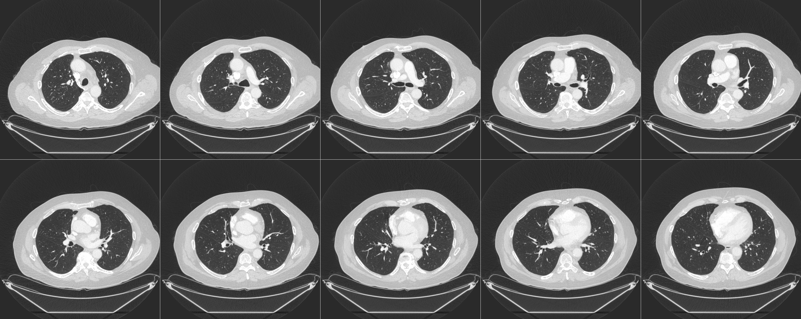

# FreeCT

**Current status (2020/08/11):**  WFBP is still now running for GE studies!  I will be confirming that each of the GE studies is successfully reconstructed over the coming week, and begin work to support the Siemens studies.  

Remaining issues:
* Need to add adaptive filtration back into the toolbox
* Need to write a basic how-to for using FreeCT
* ~~HU scaling is not working properly yet (likely related to scaling occurring in the filter and/or backprojection),~~
* We have used a kluge in the backprojection kernel to get the TCIA geometry specification to match the WFBP geometry specification, however we should do away with this approach for a final release.

### Sample TCIA Reconstructed Slices (2020/08/02)



FreeCT is open source reconstruction software for clinical 3rd generation, fan-beam CT.

This repository comprises all of the FreeCT projects, including WFBP, ICD, and our reader library.  The other FreeCT repositories are no longer maintained.  

I am in the process of converting this repository to run on the TCIA LDCT raw projection dataset (https://wiki.cancerimagingarchive.net/pages/viewpage.action?pageId=52758026).

If you,

 * are interested in contributing to accelerate this process,
 * have feature requests, or 
 * ideas for how to improve the project
 
please reach out to John at johnmarianhoffman@gmail.com.

Any "timelines" provided below are best guess estimates and are subject to change.

The existing FreeCT repositories will be FROZEN to support anyone who has been previously using them (although we apologize for any breaking changes we have made in the last few weeks), and no further work will be done to support them.  Many of the upcoming changes will break backwards compatibility in the effort to concentrate our support on the TCIA LDCT data set first and foremost, since it has the widest availability.

Thanks for your interest and please stay tuned!

Best,
John

## Building FreeCT
### Dependencies
FreeCT depends on several external packages:

* [DCMTK](https://dcmtk.org/) for DICOM support
* [YAML-cpp](https://github.com/jbeder/yaml-cpp) for YAML parsing 
* [Boost](https://www.boost.org/)
* [Eigen 3](https://eigen.tuxfamily.org/index.php?title=Main_Page)
* [NVidia CUDA Toolkit](https://developer.nvidia.com/cuda-toolkit)

The easiest way to install these is via your system package manager.  

On Ubuntu 18.04:

```bash
sudo apt install libdcmtk-dev libyaml-cpp-dev libboost-all-dev libeigen3-dev nvidia-cuda-toolkit
```
*If you run into CMake error messages regarding FFTW3 not being found, please skip to the end of this section and manually install FFTW3 rather than using the package manager.*

### Build the FreeCT applications (after dependencies have been installed)
To build, we follow a standard CMake workflow:

```bash
git clone https://github.com/FreeCT/FreeCT.git
cd FreeCT/
mkdir build && cd build

cmake ../
make -j5 
```

Individual targets can be build if you don't want to build everything:
```
make -j5 fct_read
make -j5 fct_read_util
make -j5 fct_wfbp # BUILDING AND RUNNING ON GE DATA
make -j5 fct_icd  # NOT BUILDING
```

We will do our best to add support for other platforms (or please create a pull request if you would like to add instructions on installing dependencies for other platforms)

# Planned Development work for FreeCT
## Near-term work to enable use on TCIA datasets:
Short-term goal is to get SOMETHING running for the LDCT dataset.  This primarily involves modifications to the reader library and "setup" components of the FreeCT_wFBP packages.  ICD will eventually be ported, however we do not have a timeline for that.

Timeline for work: 2 weeks - 1 month 

* Convert FreeCT_Reader to support TCIA DICOM format (**done**)
* Modify FreeCT_wFBP setup.cu: support reading scanner data directly from RawDataSet class (**done**)
* Modify FreeCT_wFBP setup.cu: New structure for YAML input files (**done**)
* Migrate all project components (Reader, WFBP, ICD) into a single repository (this repository) with a unified build process (**done**)
* Any required modifications to the reconstruction process b/c of new input structures (*in progress*)
  * On-the-fly generation of filter kernels required to reconstruct GE, replace old file-based system (**done** and validated!)
  * Debugging on GE data (**done**)
  * Debugging on Siemens data (*in progress*)

(updated on 2020/08/02)

## Mid-term work to improve FreeCT usability
Larger, project-level restructuring to make downloading, building, and installing required FreeCT components easier.  This will necessitate a license change (likely going to Apache 2.0 license.)

Timeline for work: 2 - 6 months 

* Unit tests to improve development process 
* Convert filtering in WFBP to use CuFFTW
* Unified configuration file structure/parsing framework
* Packaging of the project Ubuntu (and potentially other high-use OSes)
* Set up a continuous integration system to keep users up to date on build status of FreeCT components

(updated on 2020/07/06)

## Long-term work
Timeline for work: 6 months-???

* Modernize GPU code for larger-memory cards
* Better decoupling of CUDA code from C++ code
* Python wrappers
* Interoperability with other reconstruction software packages

(updated on 2020/06/28)
